# Creación y configuración de una API con Inngest, NOTIFICACION AL CREAR UN USUARIO.

## Descripción

En esta práctica se utiliza una API previamente desarrollada que incluye un **CRUD de usuarios y grupos**.  
Sobre esta API se implementa **Inngest** para la gestión de eventos y se configura un **bot de Telegram** que envía notificaciones automáticas cada vez que se crea un nuevo usuario.

---

## Tecnologías utilizadas

- Node.js
- Express
- Inngest
- Telegram Bot API
- MongoDB (API existente)
- dotenv
- Axios

---

## Variables de entorno

Crear un archivo `.env` en la raíz del proyecto con las siguientes variables:

```env
TELEGRAM_BOT_TOKEN=tu_token
TELEGRAM_CHAT_ID=tu_chat_id
```
### Ejemplo:

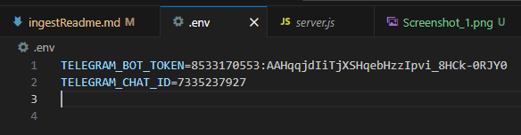


## Configurar Telegram

### 1. Obtener Token del Bot

1. Buscar en Telegram: **@BotFather**
2. Enviar el comando /start
3. Crear un nuevo bot siguiendo las instrucciones
4. Telegram devolverá:El enlace al bot y el token del bot
5. Copiar el token y guardarlo en el archivo .env
---


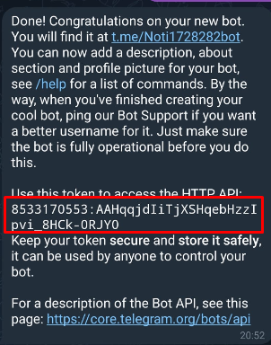

## 2. Obtener el chat id

1. Ir a https://api.telegram.org/bot<TU_TOKEN>/getUpdates, esto es la api de telegram en donde te facilitara obtener tu chat id, para ello deviste de iniciar el chat o mandar algo.
2. Pegar esa url en tu navegador.

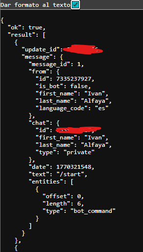

## Instalar Dependencias

Ejecutar:

```bash
npm install inngest express node-telegram-bot-api dotenv axio
```

En mi caso como ya tenia express ya instalado no haria falta


# Configurar Package.json


```bash
"scripts": {
    "start": "node server.js",
    "dev": "concurrently \"nodemon server.js\" \"npx inngest-cli@latest dev\"",
    "inngest": "npx inngest-cli@latest dev",
    "test": "echo \"Error: no test specified\" && exit 1"
}
```


## Creación archivos.


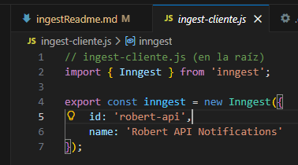


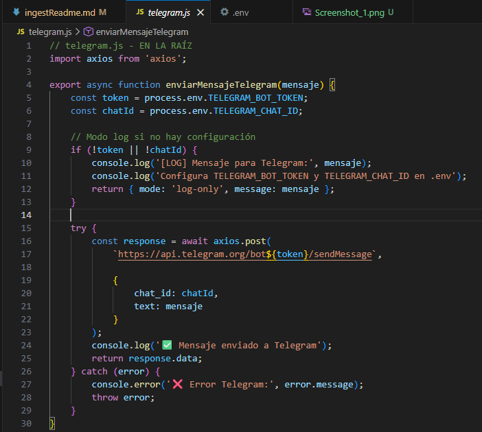

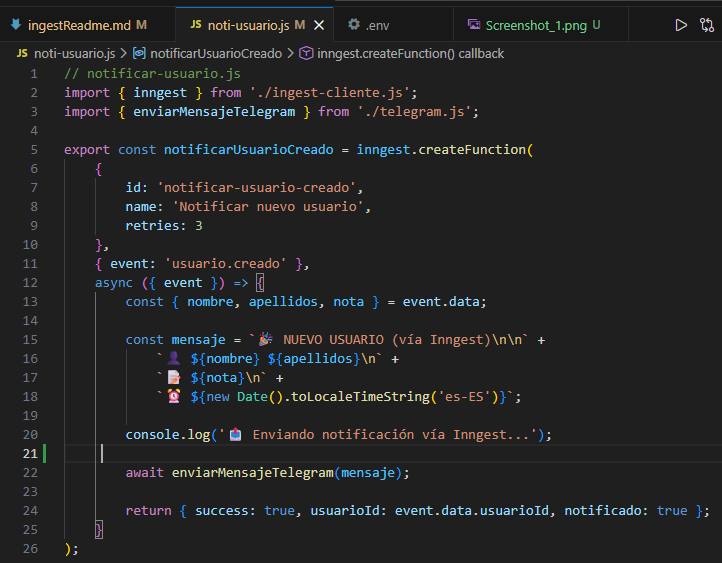


Modificacion del endpoint de crear.

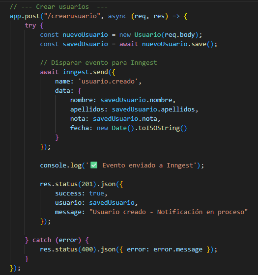


## Iniciar Proyecto, levantar api y servidor de ingest.

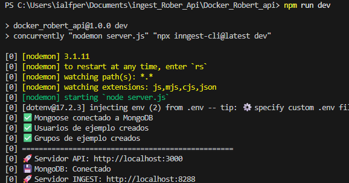


## Prueba de crear usuario

Para esta prueba podemos usar deferentes opcion en mi caso use la extension ThunderClient, pero tambien hay otras como Postman o Bruno.

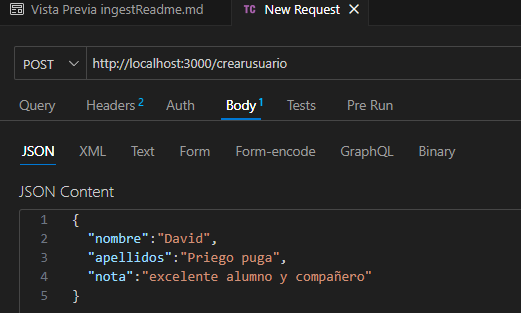


## Comprobacion en el bot


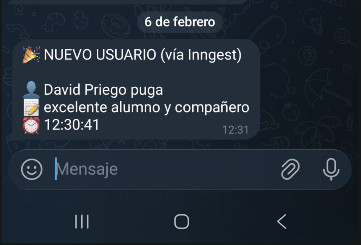


## Comprobacion en el servidor de ingest

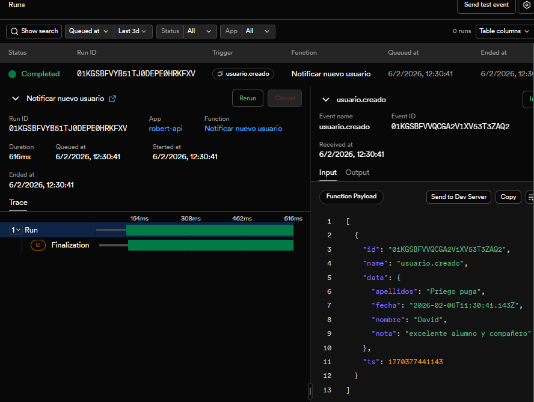


### Flujo del proceso
